# GrandRue Design Dependency Graph

**Document type:** Design dependency / roadmap graph
**Source roadmap:** `Main_Street_Handoff_MS-PROT-084_and_Digital_Operating_Infrastructure_Roadmap.md`
**Source handoff date:** 8 September 2026
**Repository:** `swangune/GrandRue`
**Target branch:** `development`
**Handoff snapshot head:** `95b48f9a1699fe55f91bfb9f5247cdf0786e1a73`
**Current repository overlay inspected after the handoff:** `497be054c9da7606b804c565824d28796a6848c6`
**Subsequent approved design formalised with this overlay:** MS-PROT-085 v1.1 — Initial Enquiry Review Attention Contract; MS-PROT-086 v1.1 — Initial Customer Messaging Channel Portfolio; MS-PROT-053 v1.3 — Enquiry and Customer Communication Retention Qualification & Period Amendment; MS-PROT-086 v1.2 — Conversation Browser Access, Resume & View Contract Amendment; MS-PROT-085 v1.2 — Customer Communication Human Response Attention Contract Amendment; MS-PROT-086 v1.3 — Initial Customer-Service Response Contract Portfolio Amendment; MS-PROT-087 v1.1 — Initial Campaign Purpose & Outreach Portfolio Amendment; MS-PROT-087 v1.2 — Initial Audience Definition & Attribute Portfolio Amendment; MS-PROT-075 v1.2 — Notification Policy Portfolio Closure Amendment; MS-PROT-088 — Merchant Brand Namespace, Custom Domain & Business Email Identity Model; MS-PROT-042 v1.9 — Appointment Occurrence Outcome, Evidence & Correction Amendment; MS-PROT-042 v1.10 — TimeProposal Expiry & Appointment Proposal Capacity Protection Amendment; MS-PROT-042 v1.11 — Merchant-Initiated Reschedule Customer Decision & Appointment Check-In Evidence Amendment; MS-PROT-042 v1.12 — Appointment Support Requirement, Assignment Continuity & Resource Substitution Amendment; MS-PROT-042 v1.13 — Recurring & Shared Appointment Commitment Amendment; MS-PROT-042 v1.14 — Booking Discharge, Utilisation Outcome & Commitment Amendment Model; MS-PROT-042 v1.15 — Capacity-Demand Exception Feature Admission & Ownership Disposition Amendment; MS-PROT-089 — Capacity Waitlist & Availability Opportunity Coordination Model; MS-PROT-087 v1.3 — Direct Outreach Safety & Automated Campaign Execution Amendment; MS-PROT-083 v1.1 — Campaign Evidence, Measurement & Attribution Boundary Amendment; MS-PROT-090 — External Review Solicitation, Reputation Observation & Merchant Response Coordination Model; MS-PROT-083 v1.2 — Customer Return Behaviour, Retention Boundary & Re-engagement Analytical Handoff Amendment; MS-PROT-091 — Workforce Rota Composition & Assignment State; MS-PROT-092 — Document Intake, Extraction Candidate & Evidence Validation Coordination Model; MS-PROT-081 v1.2 — Cross-Arrangement Overlap & Merchant Scheduling-Buffer Amendment; MS-PROT-081 v1.3 — Workforce Scheduling, Leave Notification & Reminder Contract Portfolio Amendment; MS-PROT-083 v1.3 — Initial General Business Intelligence Measure Portfolio Amendment; MS-PROT-040 v1.6 — Replacement & Reinstatement Configuration Approval Authority Amendment; MS-PROT-040 v1.7 — Non-Initial Configuration Activation Authority Amendment
**Purpose:** Replace the handoff's predominantly linear feature roadmap with an explicit dependency graph that shows what owns business truth, what consumes it, what coordinates it, what is blocked, and what is merely prioritised rather than prerequisite.

---

## 0. Execution authority

`SEQUENCE.md` is a dependency-navigation and sequencing aid. It is **not** an execution-governance substitute.

Before acting on any node, edge, next-step recommendation, design phase, formalisation step or implementation implication in this graph, the executor **MUST consult the current `designs/DESIGN-RULES.md` on the target branch** and follow the lifecycle, approval boundary, repository-isolation requirements, review/falsification requirements, formalisation rules and corpus-conformance requirements that apply at that time.

Canonical execution rule:

```text
SEQUENCE.md
    identifies dependency / candidate next work
        ↓
consult current designs/DESIGN-RULES.md
        ↓
determine the permitted lifecycle step
        ↓
execute only that permitted step
```

If `SEQUENCE.md` and `designs/DESIGN-RULES.md` differ, are ambiguous, or imply different execution behaviour:

```text
designs/DESIGN-RULES.md governs execution
```

A graph edge such as `REQUIRES`, `GATED BY`, `RESOLVES`, `BLOCKED BY` or an apparent next node **does not itself authorise** repository writes, acceptance, implementation, deferred-decision closure, authority promotion or branch changes. Those actions require the applicable DESIGN-RULES lifecycle state and approvals.

For material design decisions, the current DESIGN-RULES lifecycle must be consulted rather than inferred from this file. At the inspected repository state, that lifecycle includes Fundamental Vision Conformance, review, falsification, recommendation, complete pre-approval presentation in ChatGPT, explicit manual approval, repository formalisation, governance updates, implementation-rules impact review, corpus conformance and commit to `development`.

---

## 0.1 Interpretation rule

This graph does **not** create new GrandRue design authority.

It has two information layers:

1. **Handoff-derived architecture** — capability relationships and roadmap content taken from the handoff.
2. **Current repository-status overlay** — later Git status observed on `development`, used only to prevent stale handoff status from being mistaken for current repository authority.

Where the handoff does not state a strict dependency, the graph labels the relationship as **STRUCTURAL / INFERRED** rather than silently turning roadmap order into normative architecture.

### Edge types

| Edge | Meaning |
|---|---|
| `REQUIRES` | The target cannot be correctly realised without the source capability/authority. |
| `CONSUMES` | The target consumes governed facts, evidence or measures owned by the source. |
| `COORDINATES` | The target coordinates source-owned domains without taking ownership of their truth. |
| `PROJECTS` | The target exposes or summarises source-owned truth to a role/user surface. |
| `EXECUTES THROUGH` | The target delegates execution to an existing governed capability or provider adapter. |
| `RESOLVES` | An accepted authority closes a registered deferred question. |
| `BLOCKED BY` | The target must not proceed until the blocking authority/decision is resolved. |
| `GATED BY` | Production use is permitted only after the named portfolio/implementation decision. |
| `STRUCTURAL` | Relationship is strongly implied by the handoff's operating model, but is not presented there as a formal hard dependency. |

---

# 1. Product-purpose root

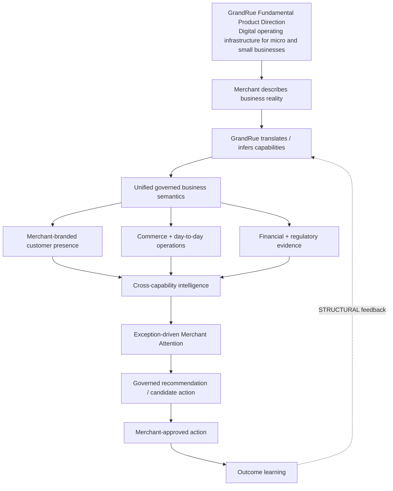

The defensible architecture is therefore not a feature bundle. It is the dependency chain:

```text
ordinary-language merchant intent
    -> capability inference
    -> unified operational semantics
    -> merchant-branded presence
    -> commerce + operations
    -> financial + regulatory evidence
    -> cross-capability intelligence
    -> Merchant Attention
    -> governed recommendations
    -> merchant-approved action
    -> outcome learning
```

---

# 2. Merchant operating-loop graph

The handoff describes an operating loop, not a collection of independent modules.

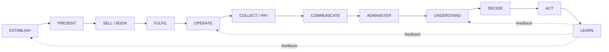

### Loop-to-capability mapping

| Operating stage | Primary capability families |
|---|---|
| ESTABLISH | merchant account, profile, identity, locations, hours, configuration, capability inference, onboarding, verification |
| PRESENT | merchant website, catalogue/service/resource listings, branding, domains, announcements, discovery metadata |
| SELL / BOOK | Products, Services, Orders, Appointments, Bookings, Bookable Resources, availability, capacity, allocation |
| FULFIL | order/appointment/booking execution, inventory consequences, staff/resource participation |
| OPERATE | workforce, inventory, customer context, capacity, schedules, POS/front desk |
| COLLECT / PAY | Payment Obligations, Payment Applications, provider handoff, settlement evidence, reconciliation, financial commitments |
| COMMUNICATE | web chat, messaging, notifications, confirmations, reminders, customer-service conversations |
| ADMINISTER | regulatory administration, evidence, documents, audit, routine obligations |
| UNDERSTAND | governed measures, BI, Business Health, Financial Health |
| DECIDE | claims, diagnosis, forecast, scenario evaluation, impact estimates, recommendations |
| ACT | merchant instruction -> existing capability command / supported provider execution |
| LEARN | outcomes, observations, performance evidence, future decision improvement |

---

# 3. Core capability dependency graph

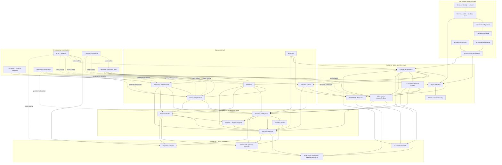

### Important ownership invariant

The arrows into BI, Financial Health, Business Health, Merchant Attention, AI and the dashboard are **consumption/coordination edges**, not ownership transfers.

```text
source capability owns business truth
    -> derived capability consumes governed truth
    -> derived capability does not become source authority
```

---

# 4. Commerce / fulfilment dependency cluster

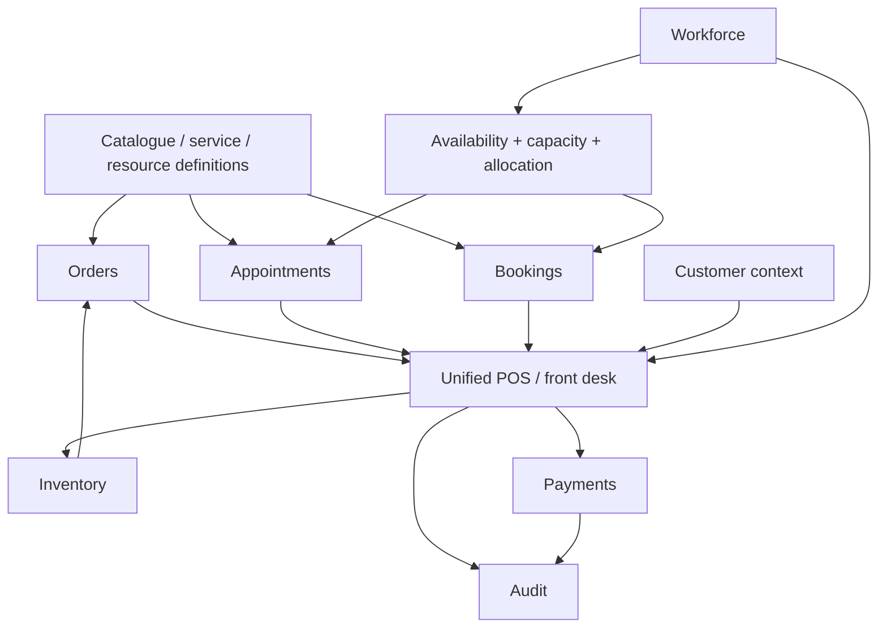

### Semantics preserved by the handoff

```text
Products  -> Orders
Services  -> Schedule / Appointments
Resources -> Bookings
Hybrid    -> combination
```

The dependency is on generic commerce semantics, not on business-type-specific applications.

---

# 5. Financial / regulatory / evidence dependency cluster

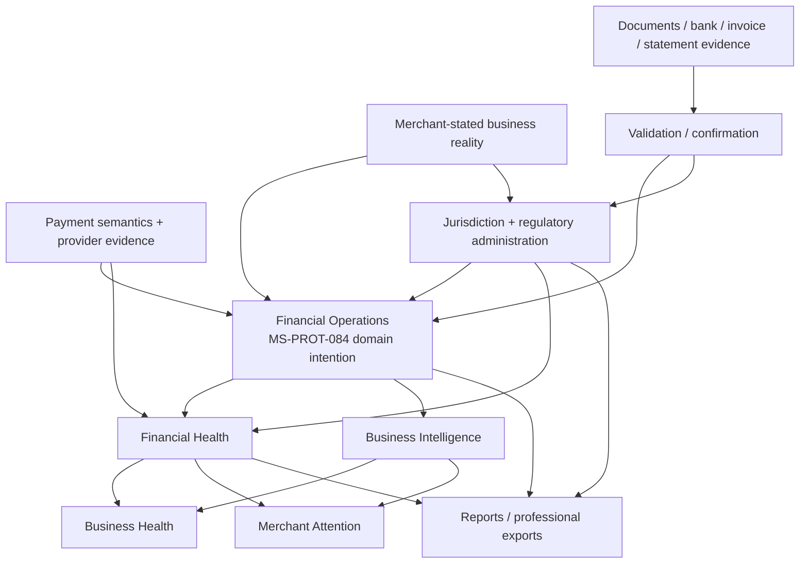

### Financial truth boundaries

The handoff explicitly preserves:

```text
customer obligation
    != provider transaction
    != settlement
    != revenue
    != profit
```

and:

```text
document extraction candidate
    != authoritative financial/regulatory fact
```

Therefore document ingestion, payment-provider evidence and bank evidence are inputs to governed semantics; they do not automatically become accounting truth.

Accepted MS-PROT-092 now governs the generic `DocumentIntake → ExtractionCandidate → owner-qualified validation/evidence handoff` boundary. It deliberately does not resolve the blocked Financial Operations-specific `MS-PROT-084-DQ-013` contract.

---

# 6. Intelligence -> Attention -> Action graph

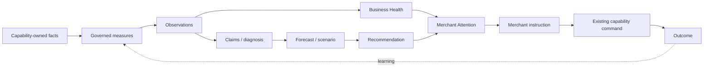

### Hard behavioural constraints

- BI should answer **what is happening, why, what may happen next, and what the merchant should consider doing**.
- `UNKNOWN` is a valid analytical state.
- Recommendations do not themselves mutate business state.
- Scenario assumptions do not silently become merchant configuration.
- Merchant Attention owns handling workflow, not underlying business truth.
- Execution remains through the source capability's accepted command/application contract.

---

# 7. Merchant Attention dependency graph

The handoff positions Merchant Attention as a coordination surface over multiple independently-owned domains.

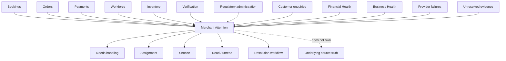

**Current repository overlay:** Composite MS-PROT-085 through v1.2 is accepted Merchant Attention authority. v1.1 selects the initial `enquiry / initial-submission-review@1` family; v1.2 adds exactly `customer-communication / human-response-required@1` for Customer Communication-owned response assessments requiring human handling. The Attention occurrence records handling coordination only: acknowledgement/open/read do not satisfy the response obligation, and requested Refund/Cancel/Amend operations remain with their source owners. Merchant activation and implementation remain separately governed.

---

# 8. Customer communication dependency graph

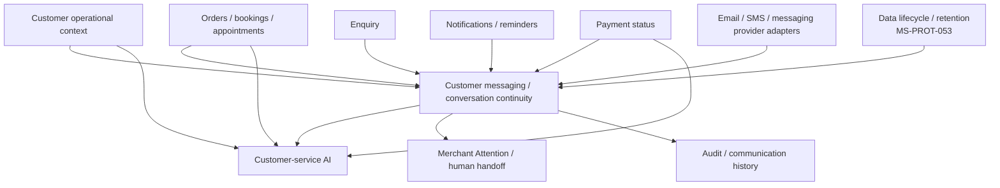

**Current repository overlay:** Composite MS-PROT-086 through v1.3 is accepted Customer Messaging / Conversation Continuity / Customer-Service Handoff authority. v1.1 resolves the initial channel portfolio with Merchant Website Messaging plus Conversation-Bound Email. MS-PROT-053 v1.3 resolves the concrete Enquiry/Customer Communication retention prerequisite under `MS-PROT-043-V14-DQ-007`. MS-PROT-086 v1.2 resolves browser access/resume/view under `MS-PROT-086-DQ-003` with two non-interchangeable paths: authenticated registered-customer access from authoritative CustomerContext participation, and a one-Conversation possession-bound Guest Conversation Access Grant/Proof. The guest grant permits exactly `VIEW` and `APPEND_TEXT_MESSAGE`, uses a 90-day inactivity expiry and 12-calendar-month absolute lifetime, does not derive authority from contact equality, remains independent from Conversation-Bound Email routing and Message retention, and grants no source-object authority. MS-PROT-086 v1.3 resolves `MS-PROT-086-DQ-002` by selecting exactly seven fact-first Customer-Service Response Contract families: public merchant information; public offering information; published policy information; current Scheduling availability; related Booking/Appointment information; related Order/Fulfilment/Shipment information; and related Payment/Refund information. Automated substantive response requires complete material-request coverage, exact owner-qualified current evidence/access, deterministic validation, transparent automated participation and the paired MS-PROT-085 v1.2 `customer-communication / human-response-required@1` Attention path. AI confidence, generic FAQ/RAG material and Conversation access do not create response or source-object authority. DQ-004 remains separately gated. Exact physical guest credential representation remains separately gated by `ADR-014-DQ-011` before production Guest Conversation browser access. No Customer Messaging, automated-customer-service or merchant activation is authorised.

---

# 9. AI dependency graph

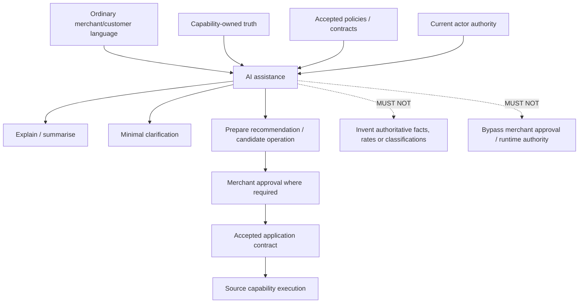

AI therefore depends on the semantic and authority layers beneath it. It is an interface and reasoning/assistance layer, not the source of business truth.

For external/untrusted document processing, accepted MS-PROT-092 preserves `MS-PROT-057-V11-DQ-010` as an implementation/security prerequisite rather than treating semantic acceptance of document intake as permission to ingest hostile documents in production.

---

# 10. Provider / integration dependency graph

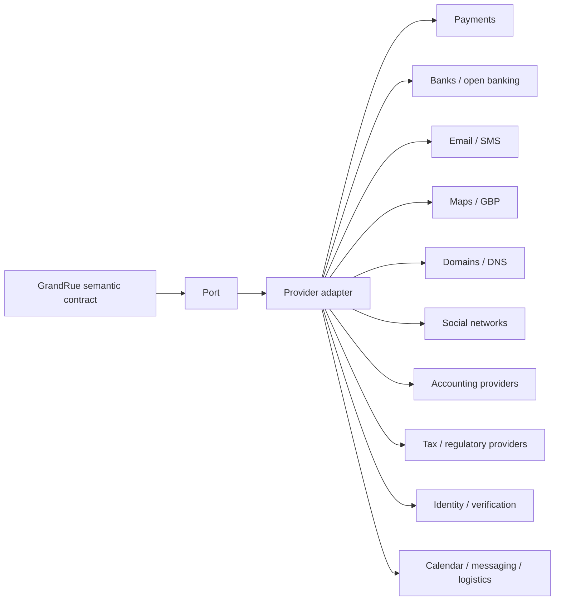

Provider choice is downstream of GrandRue semantics.

```text
provider API
    MUST NOT define
GrandRue business meaning
```

---

# 11. Cross-cutting dependency layer

The following are not independent end-user modules. They support many capability families.

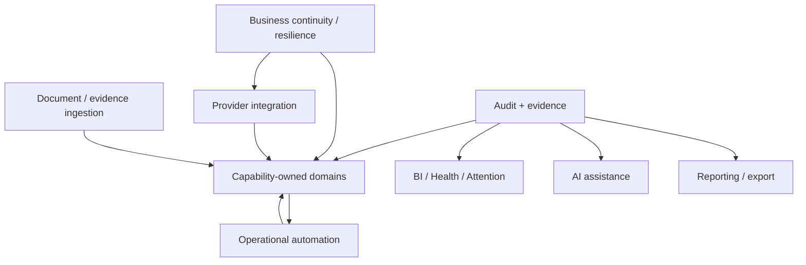

Cross-cutting invariants:

- automation may perform safe routine administration, not substitute merchant/professional judgement;
- audit must preserve what happened, who/what initiated it, authority, evidence and resulting change;
- reports must consume governed facts/measures rather than implement independent formulas;
- resilience must address degradation, retry safety, manual fallback and later reconciliation.

Accepted MS-PROT-092 now provides the generic semantic boundary for the `DOC` node while preserving owner-capability admissibility and truth.

---

# 12. Priority graph — priority is not dependency

The handoff's Priority A/B/C classification is retained as **delivery/design importance**, not converted into a false sequential chain.

## Priority A — infrastructure-critical

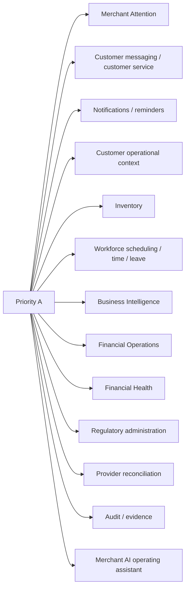

Several of these have real dependency edges elsewhere in this document, but the Priority A list itself does not establish their implementation order.

For Workforce, composite MS-PROT-081 through v1.3 remains the Scheduling/Timekeeping/Leave authority and accepted MS-PROT-091 provides the bounded rota-composition/open-shift/cardinality/WorkSite refinement. MS-PROT-081 v1.2 resolves `MS-PROT-081-DQ-021` for cross-Arrangement overlap and optional merchant-owned inter-commitment buffer policy. MS-PROT-081 v1.3 partially resolves `MS-PROT-081-DQ-015` for the exact Scheduling/Leave/Scheduled Work reminder Notification Contract portfolio while preserving the Timekeeping notification/reminder remainder pending DQ-009 through DQ-012. `MS-PROT-081-DQ-013` remains unresolved. None of these accepted Workforce amendments activates implementation.

## Priority B — strong platform expansion

- invoicing
- supplier/counterparty management
- simple procurement
- outgoing merchant payments
- bank/open-banking connectivity
- document ingestion — **DESIGN-CLOSED — GENERIC EVIDENCE BOUNDARY** through accepted MS-PROT-092; domain-specific Financial/Regulatory/Verification consumption remains separately governed and production untrusted-document ingestion remains security-gated
- review/reputation operations — governed for the initial portfolio by accepted MS-PROT-090 v1.0; future excluded expansion requires fresh Feature Admission
- marketing/campaign operations
- accounting-provider integration
- customer retention/re-engagement — **DESIGN-CLOSED — INITIAL PORTFOLIO** through accepted MS-PROT-083 v1.2 composed with existing CustomerContext, source-commerce, Marketing and Notification authority; no standalone Retention/CRM capability
- richer scenario planning
- domain/social/search synchronisation

## Priority C — evidence-driven / ERP-drift risk

- statutory bookkeeping
- general ledger
- automatic depreciation
- inventory financial valuation
- universal accounting profit
- cross-merchant benchmarking
- autonomous pricing
- autonomous staff scheduling
- automatic financial transfers
- sophisticated CRM
- supply-chain ERP
- full HRIS
- generic project management

Priority C items are intentionally not prerequisites for the operating-infrastructure model.

---

# 13. Feature-admission gate

Every new graph node should satisfy at least one admission test before being promoted into the roadmap.

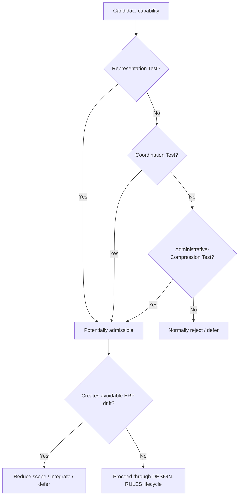

---

# 14. MS-PROT-084 authority dependency graph — handoff snapshot

This section preserves the handoff's own state rather than silently rewriting it from later Git history.

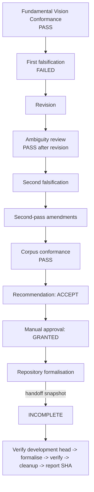

### Handoff-stated resolution edges

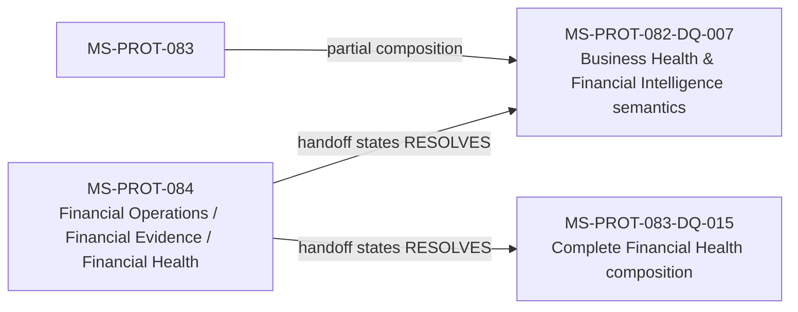

### Current repository overlay for MS-PROT-084

After the handoff, `development` did **not** end up with the complete MS-PROT-084 base authority described by the handoff. The repository currently preserves the approved targeted amendment as a standalone record while the exact base composition remains blocked. Therefore:

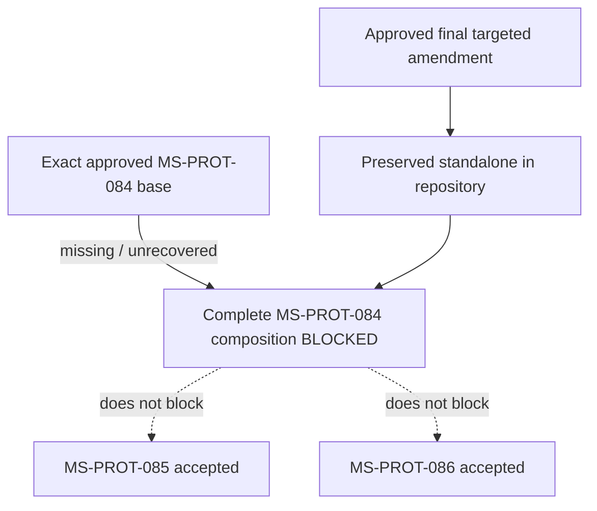

This overlay changes **repository status**, not the handoff's broader Digital Operating Infrastructure roadmap.

---

# 15. MS-PROT-084 deferred-decision dependency register

The handoff introduced sixteen explicit future decision gates. They should be represented as downstream dependencies rather than treated as work already completed.

| DQ | Decision | Primary graph dependency / activation point |
|---|---|---|
| MS-PROT-084-DQ-001 | Initial Operating Cost Portfolio | Before production operating-cost semantics require a concrete supported portfolio |
| MS-PROT-084-DQ-002 | Initial Financial Health Portfolio | Before production Financial Health requires concrete indicators/measures |
| MS-PROT-084-DQ-003 | Financial Account Provider Portfolio | Before connecting supported financial-account providers |
| MS-PROT-084-DQ-004 | Financial Evidence Classification Portfolio | Before production evidence classification is operationalised |
| MS-PROT-084-DQ-005 | Counterparty / Supplier Authority | Before richer supplier/counterparty operations |
| MS-PROT-084-DQ-006 | Invoice Authority | Before native invoicing semantics |
| MS-PROT-084-DQ-007 | Outgoing Merchant Payment Execution | Before GrandRue initiates outgoing merchant payments |
| MS-PROT-084-DQ-008 | Inventory Financial Valuation | Before inventory becomes financial-accounting value |
| MS-PROT-084-DQ-009 | Capital Asset / Depreciation | Before depreciation / capital-asset accounting |
| MS-PROT-084-DQ-010 | Profitability Portfolio | Before broad profit claims are made |
| MS-PROT-084-DQ-011 | Currency Normalisation | Before cross-currency aggregation/conversion becomes authoritative |
| MS-PROT-084-DQ-012 | Professional Accounting Integration | Before concrete accountant/accounting-provider integration |
| MS-PROT-084-DQ-013 | Financial Document Extraction | Before extracted document facts enter governed financial workflows |
| MS-PROT-084-DQ-014 | Financial Evidence Retention | Before concrete financial retention policy is enforced |
| MS-PROT-084-DQ-015 | Statutory Accounting Boundary | Before GrandRue enters statutory bookkeeping/accounting scope |
| MS-PROT-084-DQ-016 | Financing Calculation Contracts | Before authoritative financing calculations are operationalised |

### DQ grouping graph

```mermaid
flowchart TD
    P84[MS-PROT-084 downstream decisions]

    P84 --> PORT["Portfolio definition"]
    PORT --> D1[DQ-001 Operating Cost]
    PORT --> D2[DQ-002 Financial Health]
    PORT --> D3[DQ-003 Account Providers]
    PORT --> D4[DQ-004 Evidence Classification]

    P84 --> DOMAIN["New financial-domain authority"]
    DOMAIN --> D5[DQ-005 Counterparty / Supplier]
    DOMAIN --> D6[DQ-006 Invoice]
    DOMAIN --> D7[DQ-007 Outgoing Payments]

    P84 --> ACCT["Accounting-depth boundary"]
    ACCT --> D8[DQ-008 Inventory Valuation]
    ACCT --> D9[DQ-009 Capital Asset / Depreciation]
    ACCT --> D10[DQ-010 Profitability]
    ACCT --> D15[DQ-015 Statutory Accounting Boundary]

    P84 --> CROSS["Cross-cutting financial contracts"]
    CROSS --> D11[DQ-011 Currency Normalisation]
    CROSS --> D12[DQ-012 Accounting Integration]
    CROSS --> D13[DQ-013 Document Extraction]
    CROSS --> D14[DQ-014 Evidence Retention]
    CROSS --> D16[DQ-016 Financing Calculations]
```

Accepted MS-PROT-092 supplies a generic document/evidence substrate but **does not resolve** `MS-PROT-084-DQ-013`; that DQ still requires the exact Financial Operations consuming contract after complete MS-PROT-084 composition is available.

---

# 16. Current post-handoff authority overlay

This is the minimum repository-status delta necessary to make the graph usable after the handoff.

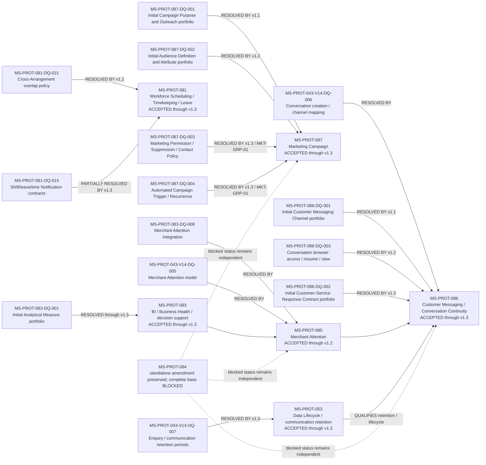

### Current production portfolio gates introduced after the handoff

| Authority | Gate | Required before |
|---|---|---|
| MS-PROT-085 | MS-PROT-085-DQ-001 — initial Attention Contract portfolio — **RESOLVED by v1.1** | Exactly `enquiry / initial-submission-review@1` selected; merchant activation and conforming implementation still required |
| MS-PROT-085 | Customer Communication human-response Attention family — **ADDED by v1.2** | Exactly `customer-communication / human-response-required@1` selected as the durable handling path paired with the v1.3 automated-response portfolio; merchant activation and conforming implementation still required |
| MS-PROT-086 | MS-PROT-086-DQ-001 — initial Customer Messaging Channel portfolio — **RESOLVED by v1.1** | Exactly Merchant Website Messaging + Conversation-Bound Email selected through `WEBSITE_MESSAGE_CREATE_V1` and `EMAIL_REPLY_CONTINUE_V1`; merchant activation and conforming implementation still required |
| MS-PROT-053 / MS-PROT-043 | MS-PROT-043-V14-DQ-007 — Enquiry/communication retention periods — **RESOLVED by MS-PROT-053 v1.3** | Concrete production Enquiry/Customer Communication lifecycle is now qualified; implementation remains separately governed |
| MS-PROT-086 | MS-PROT-086-DQ-002 — initial Customer-Service Response Contract portfolio — **RESOLVED by v1.3** | Exactly seven fact-first response families selected; automatic substantive response requires complete material-request coverage, owner-qualified current evidence/access, deterministic validation and the paired MS-PROT-085 v1.2 human-response Attention path; merchant activation and implementation remain separately governed |
| MS-PROT-086 | MS-PROT-086-DQ-003 — production Conversation browser access/resume/view mechanism — **RESOLVED by v1.2** | Registered participation-backed access and one-Conversation Guest Conversation Access Grant/Proof semantics are selected; exact physical guest credential representation remains gated by `ADR-014-DQ-011`; implementation remains separately governed |
| ADR-014 | ADR-014-DQ-011 — exact guest contextual-access credential representation | production Guest Conversation browser access implementation |
| MS-PROT-086 | MS-PROT-086-DQ-004 — initial Conversation Attachment portfolio | production message attachments |
| MS-PROT-087 | MS-PROT-087-DQ-001 — initial Campaign Purpose and Outreach portfolio — **RESOLVED by v1.1** | Exactly four purpose families and `WEBSITE_ANNOUNCEMENT_V1` + `DIRECT_EMAIL_MARKETING_V1` selected; standalone website Announcements remain MS-PROT-046-owned; audience targeting is governed by accepted v1.2 and direct-email contact/externalisation safety by accepted v1.3; merchant activation and implementation remain separately governed |
| MS-PROT-087 | MS-PROT-087-DQ-002 — initial Audience Definition and Attribute portfolio — **RESOLVED by v1.2** | Exactly `marketing-audience/existing-customer@1`, `marketing-audience/recent-customer-relationship@1` and `marketing-audience/previous-customer-reengagement@1` selected; recency is grounded only in CustomerContext-associated Order, Booking and Appointment commitment evidence; incomplete negative evidence yields `UNRESOLVED`; permission/contact authority is now resolved by v1.3 |
| MS-PROT-087 | MS-PROT-087-DQ-003 — Marketing Permission, Suppression and Contact Policy — **RESOLVED by v1.3 / MKT-GRP-01** | Jurisdiction-qualified direct-email contact-policy determination, durable endpoint/CustomerContext suppression, immediate unsubscribe, contact-pressure policy and pre-externalisation revalidation accepted |
| MS-PROT-087 | MS-PROT-087-DQ-004 — Automated Campaign Trigger and Recurrence — **RESOLVED by v1.3 / MKT-GRP-01** | Exact-revision-affined bounded automation, scheduled-single and periodic-audience trigger families, weekly/monthly local recurrence, no catch-up/replay and per-occurrence revalidation accepted |
| MS-PROT-087 / MS-PROT-083 | MS-PROT-087-DQ-005 — Campaign Measure and Attribution — **RESOLVED by MS-PROT-083 v1.1 / MKT-GRP-02** | Five exact direct-execution Campaign Measure families plus `DIRECT_EXECUTION_TRACE_V1`; no open/click/conversion/revenue/retention/ROI or downstream commercial-causation claims; this row remains v1.1-owned while `MS-PROT-083-DQ-001` is subsequently completed by v1.2 and v1.3 and is now **RESOLVED** |
| MS-PROT-083 | MS-PROT-083-DQ-001 — initial Analytical Measure portfolio — **RESOLVED through v1.3** | v1.1 campaign slice + v1.2 customer-return slice + v1.3 initial general BI portfolio; future materially different measures require fresh Feature Admission; implementation activation remains NONE |
| MS-PROT-087 | MS-PROT-087-DQ-006 — Paid Advertising, Spend and External Optimisation | Remains deferred until Financial Operations, outgoing-spend and provider/ad-account prerequisites are sufficiently authoritative |
| MS-PROT-081 | MS-PROT-081-DQ-021 — exact cross-Arrangement scheduling-overlap policy — **RESOLVED by v1.2** | Cross-Arrangement worker allocation uses explicit symmetric pair policy or exact one-off override; optional merchant-owned Membership-wide `MinimumInterCommitmentBuffer` governs sequential non-overlap; implementation remains separately governed |
| MS-PROT-081 | MS-PROT-081-DQ-015 — exact shift/leave/time Notification contracts — **PARTIALLY RESOLVED by v1.3** | Exactly seven Scheduling/Leave/Scheduled Work reminder contracts are accepted; the Timekeeping notification/reminder remainder stays deferred pending DQ-009 through DQ-012 |
| MS-PROT-092 / MS-PROT-057 | MS-PROT-057-V11-DQ-010 — exact prompt-injection detection/filtering stack | Before production external/untrusted document ingestion is enabled; MS-PROT-092 acceptance does not close this security gate |

---

## 16.1 Subsequent accepted overlay — Marketing and Merchant Attention

Composite MS-PROT-087 through v1.3 is accepted on the inspected head. v1.1 resolves `MS-PROT-087-DQ-001` by selecting exactly `marketing/merchant-news-awareness@1`, `marketing/offering-awareness@1`, `marketing/customer-appreciation@1` and `marketing/customer-reengagement@1`, with exactly `WEBSITE_ANNOUNCEMENT_V1` and `DIRECT_EMAIL_MARKETING_V1`. Standalone website Announcements remain directly MS-PROT-046-owned; the initial direct Campaign portfolio is relationship-based rather than a prospecting engine; and direct email remains MS-PROT-075 Notification rather than MS-PROT-086 Conversation-Bound Email. v1.2 resolves `MS-PROT-087-DQ-002` with the three accepted relationship/recency Audience Definition families. v1.3 resolves `MS-PROT-087-DQ-003` and `MS-PROT-087-DQ-004` together as `MKT-GRP-01 — Direct Outreach Safety & Automation`: audience membership remains distinct from contact permission; current jurisdiction-qualified direct-email contact policy and suppression dominate externalisation; contact pressure is bounded across Campaigns; standing automation is exact-revision-affined, finite and limited to scheduled-single plus weekly/monthly periodic audience reevaluation; missed/paused occurrences are not replayed; and every occurrence/recipient is revalidated before external effect. DQ-005 is resolved by accepted MS-PROT-083 v1.1 / `MKT-GRP-02` through a deliberately narrow direct-execution measurement portfolio with no commercial-causation authority; DQ-006 still gates paid advertising/external spend. No Marketing implementation or merchant activation is authorised, and the MS-PROT-084 blocker is unchanged.

**Marketing grouped execution overlay:** `MKT-GRP-01` and `MKT-GRP-02` are **COMPLETE**. MS-PROT-083 v1.1 resolves `MS-PROT-087-DQ-005` and the campaign-specific slice of `MS-PROT-083-DQ-001`; accepted v1.2 and v1.3 subsequently complete the remaining customer-return and initial general BI slices, so `MS-PROT-083-DQ-001` is now **RESOLVED**. `MKT-GRP-03 / MS-PROT-087-DQ-006` remains deferred until Financial Operations/spend/provider prerequisites are sufficiently authoritative. No Marketing package is currently next; execution returns to the global dependency frontier under current `DESIGN-RULES.md`. Among Priority-B expansion areas, review/reputation remains a dependency-ready non-financial candidate and must still undergo ordinary feature admission/ownership analysis before promotion.

MS-PROT-085 v1.1 selects exactly `enquiry / initial-submission-review@1` and resolves `MS-PROT-085-DQ-001`. Dependencies are the accepted Enquiry submission authority, the v1.0 Attention model, configuration/activation and current access, protection and Projection/Exposure authorities.

The v1.1 contract records explicit Controller review, not response or Enquiry resolution. Assignment, snooze and historical backfill remain excluded from that family.

MS-PROT-085 v1.2 adds exactly `customer-communication / human-response-required@1`. Its source is an exact inbound ConversationMessage plus the exact CustomerServiceResponseAssessment that establishes human review/response is required. The contract is satisfied initially only through `HUMAN_RESPONSE_ACCEPTED` or explicit `HANDLED_OUTSIDE_MAIN_STREET_RECORDED`; opening, reading, acknowledgement or AI summarisation do not satisfy it. It does not create a response SLA or make customer-requested Booking, Order, Payment, Refund or other source operations executable Attention commands.

Activation for a merchant and implementation remain separately governed; no current implementation node is reprioritised.

This overlay qualifies older diagrams and handoff statements in this graph. It does not make a new node automatically next or authorise repository writes; Section 0 and current DESIGN-RULES continue to govern execution.

## 16.2 Subsequent accepted overlay — Customer Messaging, retention, browser access and customer-service response

MS-PROT-086 v1.1 selects exactly Merchant Website Messaging plus Conversation-Bound Email and resolves `MS-PROT-086-DQ-001`. Website initiation creates a new Conversation; Conversation-Bound Email provides asynchronous continuation without making provider threads or contact endpoints canonical identity.

For a signed-in registered customer, authenticated CustomerContext is the participant identity. For a guest, a supplied reply email remains an unverified communication endpoint and cannot become authentication, CustomerContext merge authority or protected Conversation access.

After v1.1, review identified concrete Enquiry/Customer Communication retention as a material production prerequisite. That prerequisite was deliberately promoted through DESIGN-RULES and resolved by accepted MS-PROT-053 v1.3 under `MS-PROT-043-V14-DQ-007`. v1.3 establishes the 12-month Transitory Enquiry baseline, 24-month per-Message Ordinary Customer Communication baseline, bounded provider/security/tombstone periods, minimum-scope owner-qualified business-evidence retention, plan-neutral lifecycle semantics and Recovery-owned backup retention. It does not activate Customer Messaging implementation.

MS-PROT-086 v1.2 resolves `MS-PROT-086-DQ-003`. Registered browser access derives from valid authenticated customer context, exact Merchant Scope, authoritative CustomerContext and exact Conversation participation. Guest browser access uses a distinct one-Conversation Guest Conversation Access Grant/Proof, permits exactly `VIEW` and `APPEND_TEXT_MESSAGE`, has a 90-day inactivity expiry and 12-calendar-month hard absolute lifetime, and cannot be recovered from email/phone/name equality alone. Conversation-Bound Email remains the initial cross-device guest continuity path. Browser activity does not reset historical Message retention. CustomerContext reconciliation does not automatically expand customer-side access, guest and registered authorities are not unioned, and browser access grants no source-capability mutation authority.

MS-PROT-086 v1.3 resolves `MS-PROT-086-DQ-002` with exactly seven response-contract families: `customer-service/public-merchant-information@1`, `customer-service/public-offering-information@1`, `customer-service/published-policy-information@1`, `customer-service/current-scheduling-availability@1`, `customer-service/related-booking-appointment-information@1`, `customer-service/related-order-fulfilment-shipment-information@1`, and `customer-service/related-payment-refund-information@1`. Automatic substantive response requires `COMPLETE_FOR_REQUEST` coverage for every material request atom, exact owner-qualified current evidence and protected-source access where required, fact-first response material and deterministic validation. Mixed informational/action requests are not partially auto-answered; judgement, mutation, complaint/dispute, exception, negotiation and explicit human requests go to human handling. AI confidence, generic FAQ/RAG text, web/model knowledge, Conversation participation and Guest Conversation browser access do not create response or source-object authority. Deterministic rendering is preferred when sufficient; AI language is optional, bounded and untrusted until validated. At most one bounded clarification cycle is permitted for one unresolved triggering request.

The v1.3 response portfolio requires the accepted MS-PROT-085 v1.2 `customer-communication / human-response-required@1` durable human-handoff path before production automated customer service can be activated. GrandRue may claim that a matter was passed to the business only after the corresponding Merchant Attention occurrence commits. No universal response SLA or source-operation authority is created.

The exact physical guest credential representation remains separately deferred under `ADR-014-DQ-011` and is a production prerequisite before Guest Conversation browser access implementation. `MS-PROT-086-DQ-004` remains unresolved. No Customer Messaging, CustomerAccount, attachment, automated-customer-service, human-handoff, AI-provider or credential implementation is activated or reprioritised.

No new Customer Messaging design node is automatically selected merely because DQ-002 and DQ-003 are resolved. DQ-004 remains an explicit production attachment gate, but subsequent design selection remains governed by dependency/admission evidence and DESIGN-RULES rather than DQ numbering.

---

# 17. Design frontier map

The graph reveals that GrandRue's architecture now has three distinct classes of remaining work.

## A. Core operating-infrastructure depth

These capabilities represent or coordinate routine merchant reality and therefore remain central:

```text
customer operational context
inventory
workforce scheduling / time / leave
payments + reconciliation
financial operations / financial health
regulatory administration
audit / evidence
```

The workforce rota-composition slice is governed by accepted MS-PROT-091 composed with composite MS-PROT-081 through v1.3. Cross-Arrangement overlap policy is no longer an unresolved frontier item because DQ-021 is resolved by v1.2. The bounded Scheduling/Leave/Scheduled Work reminder Notification portfolio is also no longer an unresolved frontier item because DQ-015 is partially resolved by v1.3; only its Timekeeping notification/reminder remainder stays deferred pending the applicable Timekeeping policy decisions. Remaining workforce design work is not inferred from protocol numbering and must still be selected through the normal dependency/admission process.

## B. Cross-capability coordination

These sit above source-owned truth:

```text
Business Intelligence
Business Health
Financial Health
Merchant Attention
scenario / decision support
merchant AI operating assistant
reporting / role-native operational surface
```

Composite MS-PROT-083 through v1.3 closes `MS-PROT-083-DQ-001` for the initial Analytical Measure portfolio. `MS-PROT-083-DQ-002` and the remaining BI tail remain separately deferred; no BI implementation is activated by that semantic closure.

## C. Expansion behind explicit evidence / production gates

```text
invoicing
supplier / counterparty management
procurement
outgoing merchant payments
open banking
document ingestion — generic semantic boundary now accepted under MS-PROT-092; production/security and domain-specific contracts remain gated
reputation / marketing
accounting integration
statutory bookkeeping / ledger depth
financial transfers
autonomous decision systems
```

The graph therefore discourages jumping directly from a desirable feature to implementation. A node should enter the critical path only when its incoming semantic, authority, evidence and provider dependencies are satisfied.

---

# 18. Anti-ERP dependency rule

A capability is not justified because it can be connected to the graph.

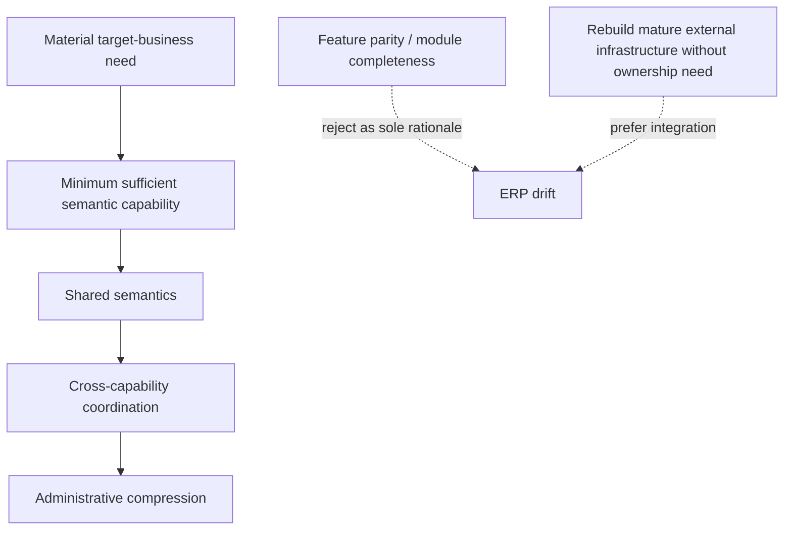

Canonical preference:

```text
minimum capability
+ shared semantics
+ cross-capability coordination
+ administrative compression
```

not:

```text
CRM for CRM's sake
Accounting for accounting's sake
HR for HR's sake
Marketing suite for marketing's sake
```

---

# 19. End-state dependency examples

## Example A — new barber hired

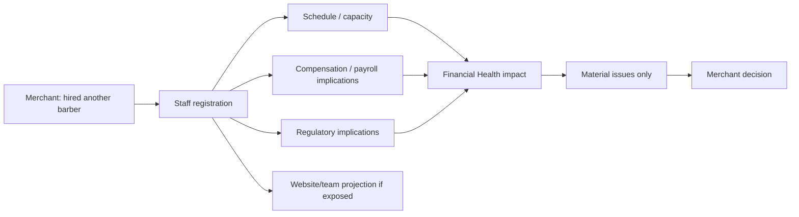

## Example B — "Business feels quieter"

```mermaid
flowchart TD
    Q["Business feels quieter"] --> BI[BI evaluation]
    BOOKINGS[Bookings trend] --> BI
    DAYS[Day-of-week concentration] --> BI
    RET[Customer return behaviour] --> BI
    CAP[Available capacity] --> BI
    BI --> CLAIM["Likely lower utilisation / excess capacity"]
    BI --> UNC["Insufficient evidence for demand-decline claim"]
    CLAIM --> REC["Review Tuesday staffing before increasing marketing spend"]
    REC --> ATT[Merchant Attention / decision support]
```

This demonstrates why the architecture depends on multiple source capabilities and evidence coverage rather than one dashboard KPI.

---

# 20. Dependency register — canonical high-level edges

| Source | Relationship | Target | Classification |
|---|---|---|---|
| merchant/business profile | REQUIRES | generated digital presence | handoff-derived |
| Merchant Brand Infrastructure / MS-PROT-088 | COORDINATES | merchant-branded website hostname + business email identity | current repository overlay |
| Merchant Brand Namespace | RESOLVES | trusted custom-domain routing and sender-identity binding to Merchant Scope without becoming tenant identity | current repository overlay |
| catalogue/service/resource semantics | REQUIRES | Orders/Appointments/Bookings | handoff-derived |
| availability/capacity | REQUIRES | appointments/bookings | handoff-derived |
| workforce | CONSUMES/QUALIFIES | capacity and service availability | handoff-derived/structural |
| MS-PROT-074 Merchant Membership + MS-PROT-081 Workforce Scheduling Arrangement | REQUIRES | MS-PROT-091 worker-specific rota/open-shift operations | current repository overlay |
| MS-PROT-091 rota/open-shift coordination | CONVERGES THROUGH | MS-PROT-081 ScheduledWorkCommitment and workforce availability authority | current repository overlay |
| MS-PROT-091 rota state | MUST NOT BYPASS | MS-PROT-081 → MS-PROT-042 customer-facing availability path | current repository overlay |
| MS-PROT-081 v1.2 | RESOLVES | MS-PROT-081-DQ-021 cross-Arrangement overlap / one-off override / merchant inter-commitment buffer policy | current repository overlay |
| MS-PROT-081 Scheduling/Leave source facts | ESTABLISH SOURCE REQUIREMENT FOR | MS-PROT-075 Notification delivery under the seven v1.3 workforce contracts | current repository overlay |
| MS-PROT-065 durable background work | WAKES | source-owned due `scheduled-work-reminder@1` responsibility without choosing reminder timing | current repository overlay |
| Orders/Appointments/Bookings | COORDINATES | unified POS/front desk | handoff-derived |
| inventory | CONSUMES/UPDATES | POS product fulfilment | handoff-derived |
| payment obligation | EXECUTES THROUGH | provider handoff / Payment Application | handoff-derived |
| provider evidence | CONSUMES | reconciliation | handoff-derived |
| documents | candidate evidence -> validation | financial/regulatory semantics | handoff-derived |
| MS-PROT-092 Document Intake / Extraction Candidate | COORDINATES | owner-qualified validation and evidence handoff to Financial/Regulatory/Verification/other source capabilities | current repository overlay |
| MS-PROT-092 duplicate/tamper observations | MUST NOT BECOME | claim-specific authenticity, subject-binding or fraud adjudication under MS-PROT-028 / verifier authority | current repository overlay |
| financial operations | CONSUMES | Financial Health | handoff-derived |
| regulatory administration | CONSUMES | Financial Health / Business Health | handoff-derived |
| all source capabilities | CONSUMES | Business Intelligence | handoff-derived/structural |
| BI / Business Health / Financial Health | COORDINATES | Merchant Attention | handoff-derived |
| Merchant Attention | PROJECTS | dashboard / operational inbox | handoff-derived |
| Enquiry / Customer Messaging | QUALIFIED BY | MS-PROT-053 data lifecycle / retention | current repository overlay |
| Customer Messaging response assessment | COORDINATES | Merchant Attention human handoff | current repository overlay |
| source-owned public/protected facts | CONSUMES | Customer-Service Response Contracts | current repository overlay |
| governed facts + assumptions | REQUIRES | scenario evaluation | handoff-derived |
| scenario/recommendation | requires merchant decision | action | handoff-derived |
| AI assistant | EXECUTES THROUGH | accepted capability contracts | handoff-derived |
| provider integration | adapter layer | capability execution | handoff-derived |
| audit/evidence | cross-cutting | operations / finance / regulation / AI | handoff-derived |
| continuity/resilience | cross-cutting | provider-backed operations | handoff-derived |
| outcome evidence | STRUCTURAL feedback | future BI / recommendations | handoff-derived |

---

## 20.1 Accepted Merchant Brand Infrastructure overlay

MS-PROT-088 v1.0 is accepted authority for the coherent merchant-brand platform-service boundary spanning custom-domain control, website hostname binding and Business Email Identity.

Its graph effect is deliberately narrow:

```text
Merchant Scope / Merchant Account
        ↓ scope
Merchant Brand Namespace
        ├── Website Hostname Binding → Storefront delivery surface
        └── Business Email Identity → authorised Notification / Customer Messaging delivery
```

The domain does not become Merchant Scope; Website and email bindings remain independently activatable; existing external website/email infrastructure is preserved by default; provider fulfilment remains replaceable; and registrar transfer is optional rather than a prerequisite for custom-domain use.

Acceptance of MS-PROT-088 does not imply that MS-PROT-089 is next. After this explicitly prioritised node, next design selection returns to this dependency graph under DESIGN-RULES and must be chosen from the real unresolved/dependency frontier rather than numeric sequence.

---

# 21. How this graph should be used under DESIGN-RULES

For any proposed next design node:

```text
1. Identify the business reality it represents or coordinates.
2. Locate its incoming dependencies in this graph.
3. Check whether those dependencies are accepted authority, unresolved DQ, provider concern, or only roadmap intent.
4. Confirm the node passes Representation / Coordination / Administrative-Compression admission.
5. Run Fundamental Vision Conformance.
6. Review ownership boundaries and anti-ERP risk.
7. Falsify against ordinary micro/small-business operation.
8. Present the complete final authority in chat.
9. Obtain explicit manual approval.
10. Formalise only after approval and update the graph/status overlay from repository authority.
```

A dependency graph can guide sequencing, but it **must not** replace the accepted Authority Index, Deferred Decision Register, canonical semantic authorities, or DESIGN-RULES lifecycle.

---

# 22. Compact critical-path view

```mermaid
flowchart TD
    F["Merchant business reality"]
    S["Core governed semantics"]
    O["Commerce + operations"]
    E["Payment / financial / regulatory / operational evidence"]
    I["BI + Business/Financial Health"]
    A["Merchant Attention"]
    D["Decision / scenario / recommendation"]
    X["Merchant-approved governed action"]
    L["Outcome learning"]

    F --> S --> O --> E --> I --> A --> D --> X --> L
    L -.feedback.-> I
    L -.business evolution.-> S

    MSG["Customer messaging"] --> A
    WF[Workforce] --> O
    INV[Inventory] --> O
    PAY[Payments] --> E
    REG[Regulatory administration] --> E
    FIN[Financial Operations] --> E
    DOC[Document evidence] --> E
    PROV[Provider adapters] --> O
    PROV --> E
```

**Architectural reading:** GrandRue becomes a digital operating infrastructure when source-owned operational truth can flow safely through evidence, interpretation, attention and governed action without forcing the merchant to manually reconcile separate software systems.

---

## MS-PROT-042 grouped deferred-scope execution overlay

Manual direction on 9 September 2026 required the retained MS-PROT-042 semantic decisions identified during the Appointment-outcome pass to be solved in small related groups before returning to ordinary global-frontier selection. MS-PROT-042 v1.10 resolved `GRP-02`; v1.11 resolved `GRP-05`; v1.12 resolved `GRP-04`; v1.13 resolved `GRP-03`; v1.14 resolved `GRP-01`; and v1.15 resolved `GRP-06` by admitting waiting-list coordination as a separately owned future capability while rejecting overbooking for the initial portfolio. The grouped MS-PROT-042 cleanup is therefore complete.

This is a sequencing overlay only. Every group still executes under current `designs/DESIGN-RULES.md` and requires its own complete proposal, conformance, review, falsification and explicit approval.

```text
MS-PROT-042 v1.9 ACCEPTED
        ↓
MS-PROT-042 v1.10 ACCEPTED
GRP-02  Appointment Proposal Expiry
        + Capacity Protection
        RESOLVED
        ↓
MS-PROT-042 v1.11 ACCEPTED
GRP-05  Merchant-Initiated Appointment Change
        + Customer Participation
        RESOLVED
        ↓
MS-PROT-042 v1.12 ACCEPTED
GRP-04  Staff Substitution
        + Resource Reassignment
        RESOLVED
        ↓
MS-PROT-042 v1.13 ACCEPTED
GRP-03  Recurring Appointments
        + Group/Multi-Customer Appointments
        RESOLVED
        ↓
MS-PROT-042 v1.14 ACCEPTED
GRP-01  Booking Outcome
        + Booking Change Semantics
        RESOLVED
        ↓
MS-PROT-042 v1.15 ACCEPTED
GRP-06  Capacity-Demand Exceptions
        RESOLVED
        ├── Waiting List: ADMITTED + RECLASSIFIED
        │       ↓
        │   MS-PROT-089 v1.0 ACCEPTED
        │   Capacity Waitlist / Availability Opportunity Coordination
        │   DESIGN-CLOSED — INITIAL PORTFOLIO
        └── Overbooking: REJECTED for initial portfolio
                ordinary capacity invariants remain
        ↓
RETURN TO GLOBAL DEPENDENCY FRONTIER
```

The order is dependency/risk oriented rather than protocol-number order. v1.15 completed the required ownership reassessment: waiting-list coordination is re-owned outside MS-PROT-042 and overbooking is rejected for the initial portfolio.

MS-PROT-089 v1.0 has completed the directly promoted capacity-waitlist lifecycle and is design-closed for its initial portfolio. The special MS-PROT-042 grouped-cleanup sequence is therefore fully exhausted. Ordinary global-frontier selection now resumes under the current `SEQUENCE.md` dependency graph and `designs/DESIGN-RULES.md`; no protocol number is selected mechanically.

---

## Subsequent accepted overlay — Review / Reputation

MS-PROT-090 v1.0 is accepted and **DESIGN-CLOSED — INITIAL PORTFOLIO**. It establishes bounded Review/Reputation coordination without creating a native review marketplace or reputation score. Source capabilities retain customer-experience truth; external providers retain review/rating truth; GrandRue owns only review-destination binding, source-qualified solicitation coordination, minimum provider review reference/provenance and merchant-approved provider-response coordination.

The initial solicitation portfolio is limited to exact accepted Appointment/Booking Review Experience Contracts, `DISABLED` or neutral `ALL_ELIGIBLE_ONCE` merchant policy, one logical solicitation per `CustomerContext × Review Destination`, EMAIL through Notification, no historical backfill, no repeat reminders and no sentiment/complaint/refund/AI gating. External review observation is sentiment-neutral for Merchant Attention; every provider-bound reply requires exact current merchant approval, and provider uncertainty reconciles before another effect.

MS-PROT-090 v1.0 has **no retained semantic DQ** for its defined initial portfolio and **implementation activation remains NONE**. Ordering/Product review solicitation, repeated solicitation, extra channels, native reviews/testimonials/NPS, cross-provider analytics, automatic replies, review dispute automation and SEO/reputation optimisation are outside the initial portfolio and require fresh Feature Admission if promoted.

Review/reputation is therefore no longer an ungoverned Priority-B candidate. Execution returns to the current global dependency frontier under `designs/DESIGN-RULES.md`; the next node is selected by dependency/readiness evidence rather than protocol number.

---

## Subsequent accepted overlay — Customer Return / Retention Boundary

MS-PROT-083 v1.2 is accepted and closes the Priority-B customer retention/re-engagement node for its initial portfolio without creating a standalone Retention or CRM capability. CustomerContext retains relationship truth; Order Fulfilment, Appointment and Booking retain source activity truth; Business Intelligence owns only exact customer-return analytical interpretation; Marketing retains re-engagement Campaign/Audience authority; Notification retains outbound delivery.

The initial customer-return portfolio contains exactly three Customer Return Activity contract families — fulfilled Order, occurred/partially-occurred Appointment and utilised/partially-utilised Booking — plus exactly four Measure Definition families: qualified-activity count, activity-customer classification count, returning-customer share and returned-after-quiet-period count. Missing history remains unresolved rather than zero; `RETURNING` is analytical rather than a CustomerContext lifecycle state; returning-customer share is not a universal retention rate.

No churn/propensity scoring, loyalty/VIP state, automatic re-engagement trigger, Campaign-to-return conversion, Campaign-caused retention, staff retention scoring or Business Health concern is introduced. A merchant may enter the already-governed Marketing re-engagement flow contextually, but v1.2 introduces no new proactive Recommendation Definition and no automatic outreach.

At the v1.2 acceptance point, `MS-PROT-083-DQ-001` was **PARTIALLY RESOLVED — CAMPAIGN + CUSTOMER-RETURN SLICES**. Accepted MS-PROT-083 v1.3 subsequently completes the remaining initial general Business Intelligence Measure portfolio, so `MS-PROT-083-DQ-001` is now **RESOLVED**. `MS-PROT-083-DQ-002` and the remaining BI tail stay deferred. Implementation activation remains NONE.

The customer retention/re-engagement roadmap node is **DESIGN-CLOSED — INITIAL PORTFOLIO**. Execution returns to the global dependency frontier under current `designs/DESIGN-RULES.md`; the next node must again be selected from actual dependency/readiness evidence rather than protocol number.

---

## Subsequent accepted overlay — Initial General Business Intelligence Measure Portfolio

MS-PROT-083 v1.3 is accepted and completes the initial general Business Intelligence Measure portfolio retained by `MS-PROT-083-DQ-001`. It adds exactly seven general Measure Definition families over already-authoritative source facts: Order commitment count, Appointment occurrence-outcome count, Booking utilisation-outcome count, outstanding Payment Obligation count, outstanding Payment Obligation value, Inventory Position constraint count and Scheduled Work Commitment person-duration.

The first three commerce measures may additionally be partitioned by the bounded source-provenance-derived `Commitment Interaction Origin` classification: `ONLINE`, `WALK_IN`, `TELEPHONE`, `OTHER_REPRESENTED` and `UNRESOLVED`. That classification is not a BI-owned sales-channel fact, technical entry mechanism, Payment/Fulfilment method or Marketing attribution.

`MS-PROT-083-DQ-001` is **RESOLVED** by the composite v1.1 Campaign slice, v1.2 Customer Return slice and v1.3 initial general portfolio. Future materially different measures require fresh Feature Admission rather than reopening this initial-portfolio DQ. `MS-PROT-083-DQ-002` and the remaining BI tail remain separately deferred. Implementation activation remains **NONE**.

---

## Subsequent accepted overlay — Workforce Rota Composition

MS-PROT-091 v1.0 is accepted as the bounded rota-composition and assignment-acquisition refinement of composite MS-PROT-081. It does not create a second worker-scheduling commitment. MS-PROT-081 `ScheduledWorkCommitment` remains the sole canonical fact that one exact workforce participant, under one exact Workforce Scheduling Arrangement and Workforce Time Terms Revision, is scheduled to work.

MS-PROT-091 owns `RotaPeriod`, rota `Shift` requirements and explicit `required_headcount`, OPEN_SELECTION `ShiftClaim` coordination, operational `ScheduleExclusion` distinct from Leave, and merchant-conditioned `WorkSite` semantics. Direct assignment and targeted offers remain MS-PROT-081 mechanisms; accepted OPEN_SELECTION claims converge atomically on an MS-PROT-081 ScheduledWorkCommitment.

The dependency boundary is therefore:

```text
MS-PROT-074 Merchant Membership
        ↓
MS-PROT-081 Workforce Scheduling Arrangement / Workforce Time Terms
        ↓
MS-PROT-091 rota composition / open-shift coordination
        ↓
MS-PROT-081 ScheduledWorkCommitment / workforce availability
        ↓
MS-PROT-042 customer-facing Appointment/capacity consumers
```

Direct `MS-PROT-091 → MS-PROT-042` bookability inference is prohibited. `MS-PROT-081-DQ-013` remains unresolved. The status assertion originally recorded by MS-PROT-091 for DQ-021 is superseded by accepted MS-PROT-081 v1.2, which resolves the cross-Arrangement overlap policy and optional merchant-owned `MinimumInterCommitmentBuffer`. The status assertion originally recorded for DQ-015 is superseded in part by accepted MS-PROT-081 v1.3: the exact Scheduling/Leave/Scheduled Work reminder Notification portfolio is resolved, while the Timekeeping notification/reminder remainder stays deferred pending DQ-009 through DQ-012. Implementation activation remains NONE.

MS-PROT-081 v1.3 admits exactly `scheduled-work-established@1`, `scheduled-work-materially-revised@1`, `scheduled-work-released@1`, `targeted-shift-offer-issued@1`, `targeted-shift-offer-no-longer-actionable@1`, `leave-decision-recorded@1` and `scheduled-work-reminder@1`. Workforce Scheduling/Leave owns why these communications exist and their source business meaning; composite MS-PROT-075 owns delivery; MS-PROT-065 owns durable wake-up; no universal reminder cadence or universal statutory Leave number is introduced.

The promoted rota-composition design node and the later DQ-021 / bounded Scheduling-and-Leave-notification amendment work are design-complete at their accepted semantic scopes. Execution returns to the global dependency frontier under current `designs/DESIGN-RULES.md`; the next design node must be selected by actual dependency/readiness and feature-admission evidence rather than by protocol numbering. The unresolved Timekeeping remainder of DQ-015 is not automatically next.

---

## Subsequent accepted overlay — Document Intake / Evidence Extraction Coordination

MS-PROT-092 v1.0 is accepted and **DESIGN-CLOSED — GENERIC EVIDENCE BOUNDARY**. It establishes the cross-cutting purpose-bound `DocumentIntake → ExtractionCandidate → owner-qualified validation/evidence handoff` semantics needed to use documents as evidence without making document content, OCR, AI or provider output authoritative business truth.

Its ownership boundary is deliberately narrow:

```text
Document / media source
        ↓
MS-PROT-092 DocumentIntake
        ↓
non-authoritative ExtractionCandidate
        ↓
exact-candidate / exact-processing-provenance validation
        ↓
owner-qualified EvidenceHandoff
        ↓
consuming capability retains admissibility + business truth
```

Composite MS-PROT-066 retains canonical media/file lifecycle; composite MS-PROT-053 retains purpose/retention/disposition authority; composite MS-PROT-057 retains AI inference and hostile-document security authority; provider participation remains MS-PROT-048-governed; regulatory consequence remains MS-PROT-082-owned; Financial Operations-specific document extraction remains blocked under `MS-PROT-084-DQ-013`; claim-specific identity/business verification, document authenticity, subject binding and fraud/conflict adjudication remain outside MS-PROT-092 under composite MS-PROT-028 and the applicable verifier.

The accepted extended falsification review contains 30 explicit adversarial cases. It establishes, among other things, that partial extraction remains partial, stale validation cannot bind a newer candidate, duplicate upload cannot duplicate accepted effects, similar-looking documents cannot be collapsed by model similarity alone, human correction is not universally authoritative, cross-purpose/cross-capability reuse is never implicit, and document content has zero command or Merchant-Scope authority.

MS-PROT-092 closes no DDR item. In particular:

```text
MS-PROT-084-DQ-013
    Financial Document Extraction
        → remains unresolved / Financial Operations-specific

MS-PROT-057-V11-DQ-010
    exact prompt-injection detection/filtering stack
        → remains required before production external/untrusted document ingestion
```

Implementation activation remains **NONE**. The generic document-ingestion design node is therefore design-complete at this semantic scope, but production processing and each domain-specific evidence contract remain separately gated. Execution returns to the global dependency frontier under current `designs/DESIGN-RULES.md`; no protocol number is selected mechanically.

---

## Lossless Deferred-Design Grouping Overlay

### Purpose

Reduce repeated design-review cost by allowing genuinely related deferred decisions to share one DESIGN-RULES execution lifecycle without merging, weakening, deleting, pre-answering or automatically promoting any individual deferred decision.

### Authority Boundary

This overlay is sequencing authority only.

`DEFERRED-DECISION-REGISTER.md` remains the canonical source of individual deferred-decision identifiers, status, ownership, classification and revisit conditions.

A group identifier:

- does not replace a DQ identifier;
- does not create semantic authority;
- does not change DQ status;
- does not promote inactive work;
- does not authorise implementation;
- does not imply that every member must receive the same recommendation or resolution.

### Lossless Grouping Gate

Deferred decisions MAY share one execution group only where all of the following hold:

1. they address the same material business or architectural problem;
2. they share a materially common activation condition or an explicit prerequisite relationship;
3. their semantic ownership is the same, or the cross-owner coordination boundary is itself the design problem;
4. a substantial part of their Vision review, architecture review and falsification evidence is legitimately reusable;
5. every original DQ identifier, owner, status, scope, exclusion and revisit condition remains independently traceable;
6. each member can independently receive ACCEPT, REVISE, REJECT or DEFER;
7. package approval contains the complete normative result for every member that is being approved;
8. grouping does not convert implementation detail into material design merely to increase group size.

If any condition fails, the decisions SHALL remain separate.

If evidence discovered during a grouped lifecycle causes the conditions above to stop holding, the affected member SHALL leave the group and continue through its appropriate independent lifecycle.

### Group Execution Rule

A group MAY share:

- dependency loading;
- Fundamental Vision Conformance;
- common ownership mapping;
- common scenario construction;
- review;
- common falsification;
- ambiguity review; and
- one complete package presentation.

Each member SHALL nevertheless retain:

- its original DQ identifier;
- its own material question;
- applicable owner and boundaries;
- its own recommendation;
- its own normative resolution where accepted;
- its own DDR status update; and
- its own resolving-authority traceability.

Approval of a group name alone does not resolve any member.

### Registered Lossless Execution Groups

#### WF-GRP-TK-01 — Timekeeping Integrity, Adjustment & Communication

Members:

- MS-PROT-081-DQ-009
- MS-PROT-081-DQ-010
- MS-PROT-081-DQ-011
- MS-PROT-081-DQ-012
- unresolved Timekeeping notification/reminder remainder of MS-PROT-081-DQ-015

Activation remains governed by the existing member revisit conditions.

MS-PROT-081-DQ-008 attendance-capture mechanism is excluded because it is a concrete mechanism rather than the Timekeeping evidence/policy question.

#### BI-GRP-METHOD-01 — Analytical Method & Qualification

Members:

- MS-PROT-083-DQ-004
- MS-PROT-083-DQ-005

The group may define the initial Analytical Method portfolio and the qualification boundary/process needed before such methods become production-authorised.

Analytical persistence, external-context sourcing and presentation remain outside this group.

#### BI-GRP-DELIVERY-01 — Merchant Analytical Presentation & Export

Members:

- MS-PROT-083-DQ-009
- MS-PROT-083-DQ-010

Interactive analytical surfaces and exported/report representations may share one claim-honesty, provenance, coverage and role-native presentation review while retaining distinct delivery semantics.

Recommendation prioritisation and analytical retention remain outside this group.

#### JRA-GRP-SCOPE-01 — Initial Jurisdiction & Regulatory Purpose Portfolio

Members:

- MS-PROT-082-DQ-001
- MS-PROT-082-DQ-002

The supported jurisdiction portfolio and the Regulatory Purposes supported within those jurisdictions shall be designed together so that GrandRue cannot imply broader regulatory coverage than the exact accepted purpose-qualified scope.

Provider selection, physical rule representation and regulatory-source monitoring remain separately governed.

#### WFC-GRP-JUR-01 — First Workforce Compensation Jurisdiction Foundation

Members:

- MS-PROT-080-V11-DQ-001
- MS-PROT-080-V11-DQ-002
- MS-PROT-080-V11-DQ-003

When the first Workforce Compensation jurisdiction slice is deliberately promoted, jurisdiction selection, treatment-resolution semantics and required jurisdiction-specific fact/evidence contracts may share one design lifecycle.

Calculation-engine selection, remittance rails, regulatory API credentials, retention, e-signature, document rendering and commercial packaging remain outside this group.

#### DISC-GRP-SEARCH-01 — Search/Index Authority & Exposure Convergence

Members:

- MS-PROT-046-V12-DQ-004
- MS-PROT-027-V15-DQ-012

This group activates only when search/discovery is deliberately introduced.

Search/index state shall remain derived from source-owned Publication/other admitted discovery truth and shall converge when Exposure removes previously observable material.

Concrete index technology remains separately governed.

#### PRES-GRP-STATIC-01 — Static Storefront Delivery & Revocation Convergence

Members:

- MS-PROT-027-V14-DQ-004
- MS-PROT-027-V15-DQ-011
- MS-PROT-046-V12-DQ-005

This group activates only if CDN/static storefront generation is introduced.

Static delivery, Exposure revocation and Publication withdrawal/revocation convergence shall be designed together so that static infrastructure cannot preserve public visibility after authoritative withdrawal.

#### REL-GRP-COHORT-01 — Multi-Cohort Semantic Release & Compatibility Routing

Members:

- MS-PROT-040-V12-DQ-007
- ADR-013-DQ-010

This group activates only when the accepted homogeneous ordinary serving-cohort model becomes materially restrictive.

Multiple semantic targets/staged cohorts and compatibility-aware routing shall be designed together without introducing merchant-visible semantic-release administration unless separately justified and approved.

### Explicit Non-Groups

The following relationships SHALL remain dependency or affinity relationships rather than execution groups unless later evidence materially changes their conditions:

- Financial Health relationships involving handoff-derived MS-PROT-084 DQs while complete MS-PROT-084 composition remains blocked.
- Currency-normalisation affinity between MS-PROT-083 and handoff-derived MS-PROT-084 scope while that blocker remains.
- Paid advertising/external spend and outgoing-payment execution.
- Conversation attachments and AI prompt-injection filtering.
- Business Health indicators and recommendation prioritisation.
- Adaptive learning and cross-merchant benchmarking.
- cross-domain retention-period decisions merely because all consume Data Protection authority.
- implementation-only API, persistence, SDK, framework, provider, transport, telemetry and presentation mechanics merely because they share an implementation phase.

### Promotion Rule

Registration in this overlay does not make a group current.

A group becomes executable only when:

- an accepted sequencing authority deliberately promotes it;
- an existing member revisit condition is reached and the design work is deliberately entered; or
- new evidence causes the applicable decision to be promoted under the current Deferred Decision Register and DESIGN-RULES.

Numeric protocol order is irrelevant.

### Failure-to-Group Rule

When uncertain whether grouping is lossless:

```text
DO NOT GROUP
```

Preserving an unnecessary extra design pass is preferable to collapsing a material semantic distinction.

### Canonical Principle

```text
share reasoning where the problem is genuinely shared
+
preserve every decision where the authority is distinct
```

The optimisation target is duplicated design effort, not semantic detail.

---

## Subsequent accepted overlay — MS-PROT-040 v1.8

MS-PROT-040 v1.8 — Configuration Reinstatement Decision Affinity Amendment is accepted and resolves the implementation-discovered `IMP-05-R3B-DG-001` semantic gap.

Every Configuration reinstatement decision is bound to the exact current Reinstatement Basis Activation. Fresh reinstatement validation/package evidence, impact-review evidence and Controller approval carry that same exact activation affinity.

A superseded initial Configuration Revision is eligible only through the bounded reinstatement path. Historical first approval, historical replacement/reinstatement approval, timestamp recency, revision identity alone and same-revision recurrence do not become current reinstatement authority.

This is design authority only:

```text
IMP-05-R3B    IN_PROGRESS
IMP-05-R3     PARTIALLY_CONFORMING
IMP-05        PARTIALLY_CONFORMING
IMP-06        BLOCKED_DEPENDENCY
```

No macro dependency edge changes. Implementation resumes tests first under composite MS-PROT-040 through v1.8 and current `designs/IMPLEMENTATION-RULES.md`.

---

## Current repository-status overlay — 15 September 2026 commercial-access synchronisation

This section is the newest repository-status overlay in `SEQUENCE.md`. Where an earlier section of this file describes a **current repository overlay**, **current frontier**, or **current commercial/deferred status** differently, this section supersedes that status statement only. Historical handoff-snapshot sections remain historical evidence and are not rewritten by this overlay.

Accepted authority now includes:

- composite `MS-PROT-050` through **v1.6**: v1.5 supplies dated `BusinessOperatingOverride` mutation, revision/currentness, concurrency, idempotency and actor-authority semantics; v1.6 classifies Public Business Hours commercial access, with `MAINTAIN_MERCHANT_PRESENCE` protecting stable-hours authoring and dated-override maintenance while bounded public/merchant observation and standard withdrawal require no independent Commercial Entitlement;
- composite `MS-PROT-080` through **v1.4**: v1.4 resolves `MS-PROT-080-V11-DQ-016` for owner-qualified Workforce Compensation / Payroll commercial access, including protected `MAINTAIN_WORKFORCE_COMPENSATION_TERMS` and `ADMINISTER_WORKFORCE_COMPENSATION` purposes for BUSINESS + GROWTH and bounded no-entitlement preparation/observation/residual-resolution contracts;
- composite `MS-PROT-081` through **v1.4**: v1.4 resolves `MS-PROT-081-DQ-020` for owner-qualified Workforce Scheduling / Timekeeping / Leave commercial access, including protected `MAINTAIN_WORKFORCE_SCHEDULING_TERMS`, `PLAN_WORKFORCE_SCHEDULE`, `COMMIT_OFFERED_WORK` and `REQUEST_WORKFORCE_LEAVE` purposes for BUSINESS + GROWTH and bounded no-entitlement observation/resolution/ending contracts; and
- composite `MS-PROT-091` through **v1.1**: v1.1 classifies Workforce Rota commercial access, protecting `PLAN_WORKFORCE_SCHEDULE`, `PARTICIPATE_IN_OPEN_ROTA_SELECTION` and `DECLARE_OPERATIONAL_SCHEDULING_UNAVAILABILITY` for BUSINESS + GROWTH while retaining bounded no-entitlement observation/resolution contracts.

These accepted owner classifications narrow the outstanding Commercial catalogue work but do **not** close it:

```text
MS-PROT-056-V17-DQ-001
    = OPEN
    = exact CommercialEntitlementIdentity definitions
      + exact target bindings
      + complete standard catalogue / manifest
```

No runtime grant may be inferred from a tier-allocation or owner-classification table alone. The executable Commercial catalogue remains not implementation-ready, and the accepted v1.4/v1.1/v1.6 amendments above all retain **Implementation activation: NONE**.

For current authority navigation, use `designs/AUTHORITY-INDEX.md`; for current deferred/resolved status, use `designs/DEFERRED-DECISION-REGISTER.md`. This sequencing overlay does not create semantic authority, implementation activation, or a new next design node.
