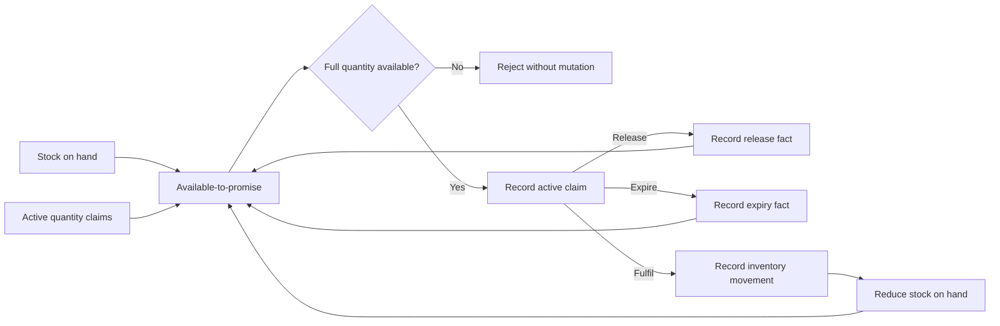

# ADR-007 — Quantity Allocation Is Reservation, Not Depletion

> **ADR ID:** ADR-007
> **Status:** Accepted
> **Date:** 20 August 2026
> **Owner:** Architecture Team

---

## 1. Context

The first allocation slice proved exclusive time-window claims. A grocery
pressure test introduces a different constraint: several claims may coexist
against one stock pool until their combined quantity reaches its capacity.

Treating a claim as immediate inventory depletion would conflate a reversible
commitment with physical fulfilment. Treating it as advisory would permit
overselling.

---

## 2. Problem Statement

How shall Main Street reserve quantities authoritatively while keeping
inventory truth, allocation and fulfilment distinct?

---

## 3. Decision

Main Street treats a quantity allocation as an **authoritative reservation**.
It is not inventory depletion or fulfilment.

- The Inventory capability owns stock-on-hand and the authority that accepts
  quantity claims against it.
- Available-to-promise is stock-on-hand minus active quantity claims.
- Check-and-claim is one atomic operation. A claim is rejected when its full
  quantity is unavailable.
- Overselling is prohibited by default. A future owned policy may change that
  rule explicitly; infrastructure or callers may not invent it.
- Release and expiry close an active claim and restore
  available-to-promise without changing stock-on-hand.
- Fulfilment records a separate inventory movement, reduces stock-on-hand and
  closes the active claim in one local transaction.
- Claims, resolutions and inventory movements remain immutable, auditable
  facts. Closing a claim does not delete its history.

---

## 4. Quantity Lifecycle Graph

---

## 5. Allocation Ownership

Conflict semantics belong to the authority that owns the constrained truth.
They are not universally intrinsic to two allocation scopes:

- Time-window exclusion compares overlapping claims for one subject.
- Quantity allocation compares the aggregate of active claims with the
  authoritative stock balance.

`AllocationScope` therefore identifies a typed claim scope. Each authority
must explicitly support its scope type and reject unsupported types rather
than guessing conflict semantics.

---

## 6. Transaction Boundary

The following fulfilment effects belong to one local transaction:

- Resolve the active quantity claim as fulfilled.
- Record the inventory movement caused by that claim.
- Reduce the authoritative stock-on-hand balance.

If any effect fails, none becomes visible. This follows ADR-006's
transactional-core rule.

---

## 7. Research Alignment

MS-PROT-006 uses “capacity consumption” as the general effect of allocation.
For quantity inventory, this ADR makes that phrase precise: allocation consumes
available-to-promise by reservation, not stock-on-hand. Fulfilment is the
separate authoritative operation that records inventory movement and reduces
stock-on-hand.

---

## 8. Consequences

### Positive

- Reservations prevent overselling without pretending fulfilment occurred.
- Cancellation and expiry can restore sellable capacity without fabricating
  inventory movements.
- Inventory movements remain an accurate account of physical or operational
  stock change.
- Concurrent claim attempts have one authoritative acceptance point.

### Negative

- Available-to-promise is derived from both stock and active claims.
- Claim lifecycle facts require persistent storage and audit history.
- Fulfilment must atomically coordinate claim resolution and inventory state.

---

## 9. Deliberate Deferrals

This decision does not yet define:

- Fractional quantities, measurement units or conversions.
- Batches, lots, serial numbers or expiry-date selection.
- Restocking, returns, waste, shrinkage or stock corrections.
- Backorders or an overselling policy.
- Automatic claim-expiry timing or scheduling.
- Distributed inventory or multi-location transfer.

The first executable slice uses whole units in one in-memory stock authority.
