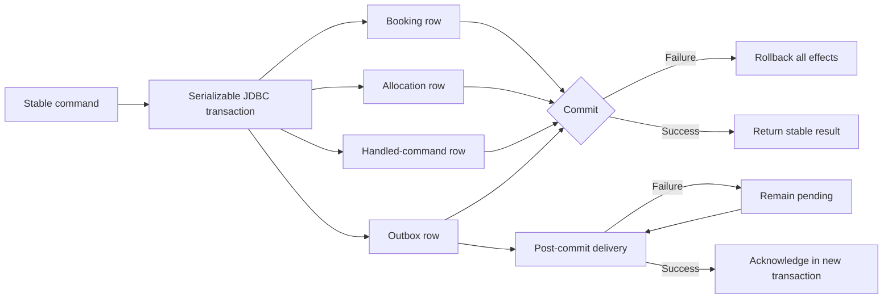

# ADR-008 — Relational Booking Transaction Boundary

> **ADR ID:** ADR-008
> **Status:** Accepted
> **Date:** 20 August 2026
> **Owner:** Architecture Team

---

## 1. Context

ADR-006 requires booking state, authoritative allocation, the domain-event
publication record and the handled-command result to commit atomically. The
in-memory booking unit of work proves that contract through copy-on-write
staging, but it cannot survive process termination or coordinate independent
runtime instances.

MS-PROT-006 fixes the atomic-allocation invariant while deliberately deferring
the concrete concurrency mechanism. MS-PROT-007 requires atomic handled-command
and publication records with at-least-once delivery. MS-PROT-015 accepts a
relational representation for the prototype and does not mandate a graph
database.

---

## 2. Problem Statement

How shall the prototype make the booking transaction durable and
concurrency-safe without coupling the domain model to a database vendor or
introducing distributed coordination?

---

## 3. Options Considered

### Option A — Independent repositories

Persist booking, allocation, outbox and idempotency state through separate
transactions.

Rejected because partial commits would violate ADR-006.

### Option B — Graph database

Persist the semantic graph and operational booking state in a graph database.

Rejected for the prototype because the booking transaction is relational and
MS-PROT-015 explicitly does not require graph storage.

### Option C — Relational unit of work

Use one JDBC connection and transaction for all locally authoritative booking
effects. Keep JDBC behind the existing booking ports and use database
constraints plus serializable isolation for the first concurrency-safe slice.

### Option D — Distributed saga

Persist each local effect independently and coordinate compensation.

Rejected inside the modular monolith because it adds failure states while
weakening a boundary that one local transaction can protect.

---

## 4. Decision

Main Street adopts **Option C: a relational booking unit of work**.

- The adapter depends on the standard `DataSource` and JDBC APIs; the booking
  domain and application service remain persistence-agnostic.
- The Booking module owns its booking, allocation, handled-command and outbox
  tables. Physical co-location does not transfer semantic ownership.
- One database transaction records all four effects.
- The first adapter uses read-committed isolation, database uniqueness
  constraints and a bounded set of database lock stripes keyed by capacity
  subject. A writer locks the subject stripe before re-evaluating conflicts.
  Claims against the same subject are therefore serialized and the later
  writer sees the preceding commit; unrelated subjects normally proceed
  independently. Hash collisions may reduce concurrency but cannot weaken
  correctness.
- An exact duplicate command reconstructs and returns the original committed
  result. Reuse of the identifier for different intent is rejected.
- Outbox acknowledgement is a separate short transaction after successful
  external delivery. Until acknowledgement commits, redelivery is expected.
- The embedded relational database is a test fixture only. This ADR does not
  select the production database or deployment platform.

---

## 5. Transaction and Delivery Loop

---

## 6. Consequences

### Positive

- Process restarts no longer lose committed bookings, allocations, command
  results or pending events.
- The existing application service can use either in-memory or JDBC adapters.
- Database constraints provide a second line of defence for stable identity.
- The transaction boundary remains local and understandable.

### Negative

- Every allocation writer must obey the same scoped-lock protocol.
- Lock-stripe hash collisions can serialize unrelated capacity subjects.
- SQL mapping and schema evolution become explicit infrastructure work.
- An embedded test database cannot prove every production-vendor behaviour.

---

## 7. Deliberate Deferrals

This decision does not yet select:

- The production relational database.
- A production migration tool or deployment process.
- Vendor-specific exclusion constraints, advisory locks or outbox claiming.
- Retry timing and contention backoff.
- Multi-worker leases, dead-letter thresholds or operator tooling.

Those choices require evidence from production access patterns or a concrete
deployment target.
