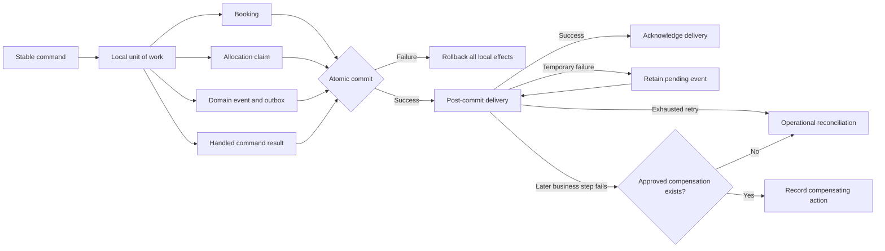

# ADR-006 — Transactional Core and Compensating Edge

> **ADR ID:** ADR-006
> **Status:** Accepted
> **Date:** 20 August 2026
> **Owner:** Architecture Team

---

## 1. Context

Main Street workflows can change several authoritative facts while also
triggering work in systems that cannot participate in the same transaction.
A booking confirmation, for example, records a business commitment, claims
capacity and publishes a fact for downstream integrations.

The research captured by MS-PROT-006 and MS-PROT-007 identifies an unresolved
failure boundary: one step may succeed while another fails. Sequential
best-effort updates could leak capacity or record a booking without its
authoritative allocation.

---

## 2. Problem Statement

How shall Main Street preserve immediate consistency inside the modular
monolith while remaining able to coordinate external, non-transactional
systems?

---

## 3. Options Considered

### Option A — One local transaction

Commit all authoritative state controlled by the modular monolith through one
application coordinator and unit of work.

This provides strong local consistency but cannot include independent external
systems.

### Option B — Saga-style compensation

Coordinate independent commits and perform explicit compensating actions after
failure.

This supports external systems but introduces lifecycle and operational
complexity that is unnecessary within one local transaction.

### Option C — Sequential best-effort updates

Apply each update independently and accept partial completion.

This is rejected because it can expose contradictory authoritative state.

### Option D — Transactional core with compensating edges

Use one local transaction for authoritative state owned by the modular
monolith. Start external work only after that transaction commits, using
durable delivery, retry and explicit compensation where the business workflow
requires it.

---

## 4. Decision

Main Street adopts **Option D: a transactional core with compensating edges**.

The following state shall commit atomically when it is controlled by the same
modular-monolith persistence boundary:

- Business state, such as a booking commitment.
- Authoritative allocation claims.
- Domain events and their durable outbox records.
- Idempotent command results required for safe replay.

External or otherwise non-transactional work shall begin only after this local
commit. It shall use durable delivery with retry and reconciliation.

Compensation shall be introduced only for a specific reversible business
obligation. A compensation is a new auditable business action; it is not a
rollback that deletes committed history.

Sequential best-effort authoritative updates are not permitted.

---

## 5. Consistency and Delivery Graph

---

## 6. First External Edge

Customer notification is the first post-commit external edge.

- A notification failure does not cancel the booking.
- A notification failure does not release the booking's allocation.
- The pending event remains available for retry.
- Delivery is at-least-once because a process can fail after the provider
  accepts a notification but before the outbox acknowledgement commits.
- The stable event identifier shall be supplied as the notification
  idempotency key where the provider supports one. Otherwise duplicate
  delivery remains an operational possibility requiring reconciliation.
- Exhausted retries require operational reconciliation.
- Notification delivery does not require a compensating booking action.

This edge proves post-commit delivery without introducing a generic saga
framework.

---

## 7. Consequences

### Positive

- Local authoritative state cannot be partially committed.
- External outages are isolated from core business commitments.
- Stable command replay can return the original committed result.
- Future external integrations have an explicit place for retry,
  compensation and reconciliation.

### Negative

- Persistent implementations must support atomic outbox and handled-command
  storage alongside business state.
- Pending deliveries require monitoring and operational recovery.
- Every compensating action requires explicit business semantics and tests.

---

## 8. Deliberate Deferrals

This decision does not yet define:

- A generic saga engine.
- Payment authorisation, capture, void or refund ordering.
- External calendar reservation and release.
- Booking cancellation or allocation-release semantics.
- Retry timing, backoff, dead-letter thresholds or operator tooling.
- A database or message-broker technology.

Those behaviours shall be introduced only through a concrete vertical slice
and its approved business failure semantics.

---

## 9. Current Executable Evidence

The in-memory booking walking skeleton proves the local contract through
copy-on-write staging:

- Booking, allocation, pending event and command result become visible
  together.
- A capacity conflict commits none of them.
- A failure after effects are staged discards all of them.
- An exact duplicate command returns the original result without repeating the
  business effect.

This in-memory implementation is architectural evidence, not a claim of
durability. A future persistent adapter must preserve the same contract with a
real transactional store and durable outbox.
